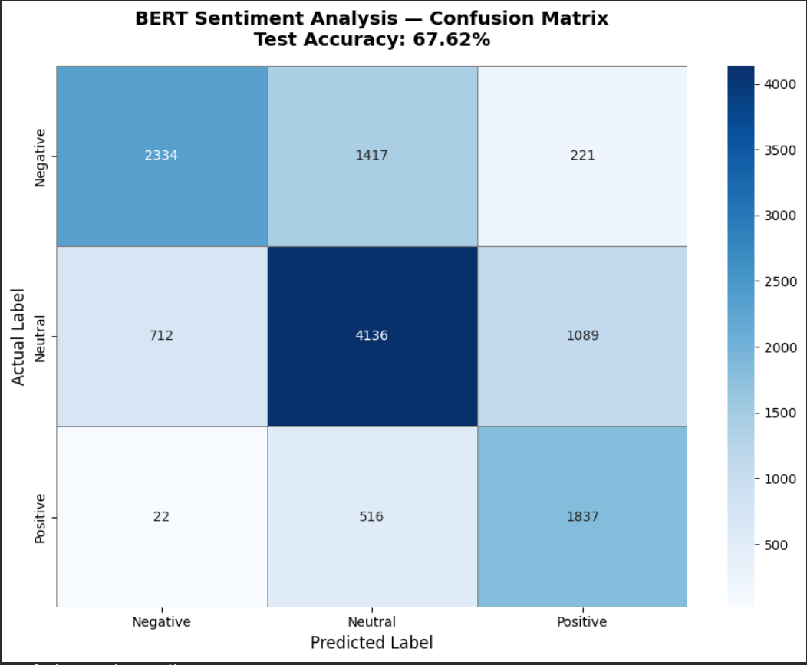

# 🤖 BERT Sentiment Analysis on Twitter Data

## 📌 Overview
Fine-tuned **BERT transformer model** for multi-class sentiment
classification on Twitter data. Classifies tweets as
Positive, Negative, or Neutral using Hugging Face Transformers.

## 📊 Results
| Metric | Score |
|--------|-------|
| Best Validation Accuracy | **74.3%** |
| Test Accuracy | 67.62% |
| Training Samples | 45,615 tweets |
| Test Samples | 12,284 tweets |

## 🖼️ Confusion Matrix

## 🛠️ Tech Stack
- Python 3.10
- PyTorch
- Hugging Face Transformers
- BERT (bert-base-uncased)
- Scikit-learn
- Google Colab (T4 GPU)

## 📁 Dataset
- **Source:** Cardiff NLP Twitter Eval Dataset
- **Classes:** Negative | Neutral | Positive
- **Train:** 45,615 | **Val:** 2,000 | **Test:** 12,284

## ⚙️ Model Details
- Base Model: `bert-base-uncased`
- Classes: 3 (Negative, Neutral, Positive)
- Max Length: 128 tokens
- Epochs: 4
- Learning Rate: 2e-5
- Batch Size: 32
- Hardware: T4 GPU (Google Colab)

## 💬 Sample Predictions
Text: "I love this so much!"
→ 😊 Positive (100% confidence)
Text: "This is the worst experience ever"
→ 😠 Negative (99.9% confidence)
Text: "Google interview went really well!"
→ 😊 Positive (100% confidence)
Text: "Best day of my life!!"
→ 😊 Positive (99.9% confidence)

## 🚀 How to Run
1. Open `Untitled0.ipynb` in Google Colab
2. Runtime → Change Runtime Type → T4 GPU
3. Run all cells in order
4. Training takes ~20 minutes

## 👨‍💻 Author
**Arjith S R**  
B.E Computer Science Engineering (AI & ML)  
Sathyabama Institute of Science and Technology, Chennai
